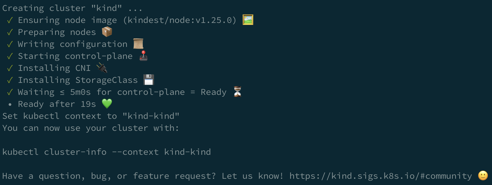
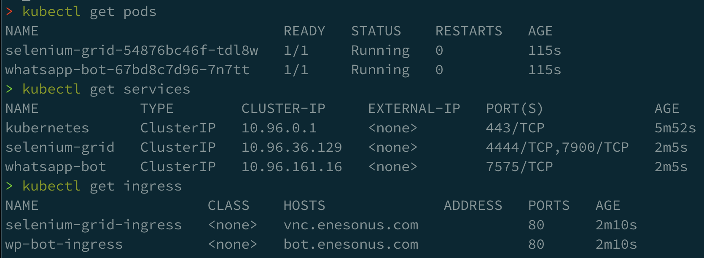

# WhatsApp Bot for Scheduled Messages

WhatsApp is an instant messaging application that's mostly used in mobile
phones. It allows you to send a message any time of the day but you cannot
schedule a message to be sent at a certain time.

This WhatsApp Bot can be used to schedule messages to be sent at a later time
and you can configure it by texting yourself.

I have done this project to learn more about Kubernetes and UI testing. The
ideal state could be to build a UI testing farm with Kubernetes clusters but I
haven't gotten that far yet.

## Architecture

At a high level, the architecture consists of a Selenium Grid running as a
`Deployment` with a `Service` that the bot calls to execute actions on a
Whatsapp Web browser instance. The bot itself is also deployed as a `Deployment`
and a `Service`. For user's access, it also has an `Ingress` object that
redirects the traffic to the bot.

You can learn more about the architecture in the following pages:
* [Developing the bot](./instructions/1-developing-the-bot.md)
* [Running the bot with Docker](./instructions/2-running-the-bot.md)
* [Deploying the bot on Kubernetes](./instructions/3-deploying-the-bot.md)

## Getting Started

### Clone the Repository

First we need to clone the repository.
```bash
git clone https://github.com/enesonus/whatsapp-bot/
```
```bash
cd whatsapp-bot
```

### Create a Cluster

> This section is mostly from [kind documentation](https://kind.sigs.k8s.io/docs/user/ingress/).

We'll use `kind` to create a new cluster. It requires custom configuration so
that we can expose it to external traffic using Ingress NGINX.

```bash
cat <<EOF | kind create cluster --wait 5m --config=-
kind: Cluster
apiVersion: kind.x-k8s.io/v1alpha4
nodes:
- role: control-plane
  kubeadmConfigPatches:
  - |
    kind: InitConfiguration
    nodeRegistration:
      kubeletExtraArgs:
        node-labels: "ingress-ready=true"
  extraPortMappings:
  - containerPort: 80
    hostPort: 80
    protocol: TCP
  - containerPort: 443
    hostPort: 443
    protocol: TCP
EOF
```



Once it's ready, install Ingress-Nginx. This will accept all the traffic coming
into our virtual machine.

```bash
kubectl apply -f https://raw.githubusercontent.com/kubernetes/ingress-nginx/main/deploy/static/provider/kind/deploy.yaml
```

Wait until it's complete.
```bash
kubectl wait --namespace ingress-nginx \
  --for=condition=ready pod \
  --selector=app.kubernetes.io/component=controller \
  --timeout=90s
```

### Deploy

Right now, it runs only for a single phone number so you'll need to change it to
your own mobile phone number.

1. Go to
[`cluster/manifests/whatsappbot.yaml`](./cluster/manifests/whatsappbot.yaml) and
change `13479998877` to your phone number - the country code is included.
1. Deploy everything into your cluster.
   ```bash
   kubectl apply -f cluster/manifests
   ```

You should see everything up and running when you run the following commands.
```bash
kubectl get pods
```
```bash
kubectl get services
```
```bash
kubectl get ingress
```



### Access

#### Under Public Domain

You can set up your DNS record to point to the virtual machine that your `kind`
cluster is running in. In order to do that, make sure you change all instances
of `enesonus.com` with your own public domain.

Once you make the change, run `kubectl apply -f cluster/manifests` again.

Now, set up the DNS records for the following domains:
* `bot.<your domain>`: A record pointing to your virtual machine IP address.
* `vnc.<your domain>`: A record pointing to your virtual machine IP address.

#### Local Access

You can forward a port on the bot's `Pod` so that it's available in your local
machine but note that this does not expose it to the public internet.

```bash
kubectl port-forward svc/whatsapp-bot 7575:7575
```

Go to http://127.0.0.1:7575 and you'll see the bot page.

### Alternatives

You can use [Cloudflare
Tunnel](https://developers.cloudflare.com/cloudflare-one/tutorials/many-cfd-one-tunnel/)
to expose your `Service` to public via CloudFlare network.

### Debug

In [`cluster/manifests/selenium.yaml`](./cluster/manifests/selenium.yaml), we
deploy an `Ingress` resource so that you can connect to the Selenium to see what
actions it take on its Chrome instance for better debugging.

Go to `vnc.<your domain>` to see what's the bot doing at any time.